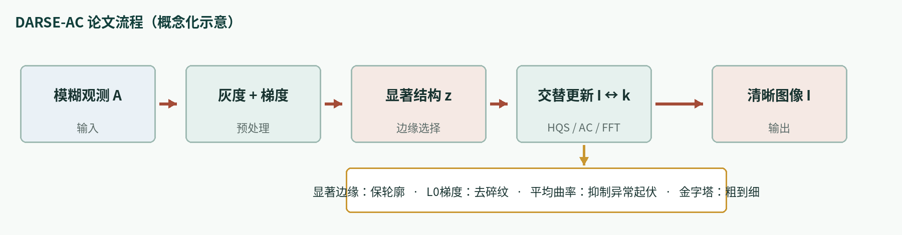
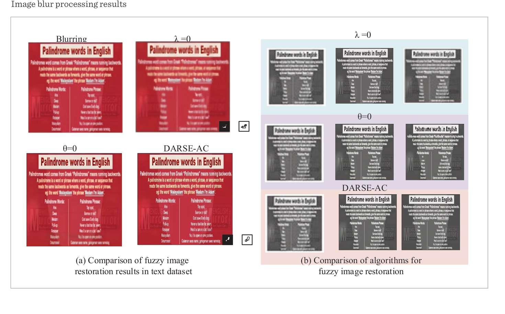
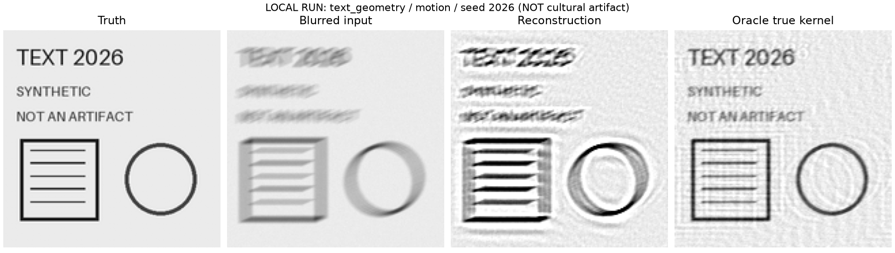

# DARSE-AC

**Blind image deconvolution with salient edges and average-curvature regularization**

This repository is maintained by the paper's first author, **Shuo Tan**, and provides the runnable Python reference implementation, experiment notes, and research records for DARSE-AC.

> Paper: Tan, S., Dong, L., An, L. (2025). *The Regularization and Deconvolution Algorithm Combining Salient Edges and Average Curvature in High-quality Visual Communication*. **Information Technology and Control, 54(1), 234–253**. [DOI: 10.5755/j01.itc.54.1.38163](https://doi.org/10.5755/j01.itc.54.1.38163)

## Motivation

The project was motivated by the practical need to improve blurred and noisy rubbing images related to the culture of the ancient Zhongshan Kingdom. The paper formulates this application need as a general blind image-deconvolution problem: estimate both a sharp image and an unknown blur kernel while preserving important lettering and ornamental boundaries.

As first author, Shuo Tan led the programming implementation, experiments, image processing, visualization, and the main manuscript work. The theoretical direction and mathematical formulation were developed with guidance from Lingye Dong; Limei An helped establish the research connection.

## Pipeline

The degradation model is:

```text
A ≈ I ⊗ k + n
```

The implementation follows this sequence:

1. Convert the observation to grayscale and compute gradients.
2. Extract a main structure `z` and salient edges.
3. Combine data fitting, edge consistency, gradient `L0`, and average-curvature constraints.
4. Split the difficult objective with HQS auxiliary variables `alpha` and `beta`.
5. Solve the quadratic image update in the Fourier domain with FFT.
6. Estimate the blur kernel in the gradient domain and project it to a nonnegative normalized kernel.
7. Run the image/kernel alternation from coarse to fine over an image pyramid.
8. Produce a final non-blind reconstruction and save the trace and kernel.



## Results reported in the paper

These are values reported by the paper on public datasets. They are not measurements on ancient Zhongshan rubbing images.

| Evaluation | Reported result | Role |
|---|---:|---|
| iNaturalist 2021 | PSNR **31.03 dB**, SSIM **0.96**, ER **1.61**, success **99.54%** | Quantitative comparison |
| ICDAR2019 | PSNR **30.29 dB**, SSIM **0.96** | Text restoration and ablation |
| GLADNet | PSNR **25.16 dB**, SSIM **0.90** | Low-light cross-dataset validation |
| RESID | Total PSNR **20.56 dB** | Realistic-blur visual and quantitative evaluation |

The paper's central conclusion is that salient-edge selection and AC regularization are complementary: the first preserves major structures, while the second suppresses unwanted curvature in non-edge regions. The reported objective curves become relatively flat after about ten iterations, while strong noise and spatially varying blur remain limitations.

## Published visual example

The following is an attributed crop of Figure 8 from the paper, showing the ICDAR2019 text ablation. It is not generated by this repository and is not a cultural-artifact image.



The figure belongs to Shuo Tan, Lingye Dong, Limei An, and the relevant rights holders. The journal page does not confirm a CC license; the paper excerpt is outside the code license.

## Quick start

Python 3.11 or a compatible version is recommended. The implementation runs on CPU and does not require CUDA or pretrained weights.

```bash
python -m venv .venv
.venv/bin/python -m pip install -r requirements.txt

.venv/bin/python experiment.py demo --output results/demo
.venv/bin/python experiment.py benchmark --output results/benchmark
.venv/bin/python experiment.py ablation --output results/ablation
.venv/bin/python -m pytest -q --junitxml=results/pytest.xml
```

For a user image:

```bash
.venv/bin/python experiment.py deblur input.png \
  --output results/your_image --kernel-size 15 --levels 3 --outer 5
```

The command writes `restored.png`, a floating-point `restored.npz`, `trace.json`, and `config.json`. Current scope is grayscale input; HDR, joint color restoration, and spatially varying kernels are outside this reference implementation.

## Local engineering validation

The fixed synthetic benchmark contains three image types, two blur kernels, and two noise seeds (12 cases), plus five module ablations. The current numerical and CLI suite has **30 passing tests**. On this local run, the complete method reaches mean PSNR 21.668 dB and mean SSIM 0.6227. These values validate the engineering path only and must not be compared directly with the paper's public-dataset results.



The image above is a generated text-and-geometry example, not a cultural artifact and not an original paper sample. Per-case metrics, configurations, traces, and ablations are stored under `results/`.

## Repository map

| File | Description |
|---|---|
| `darse_ac.py` | Operators, AC discretization, L0 thresholding, FFT image update, kernel estimation, pyramid, and final restoration |
| `experiment.py` | `demo`, `benchmark`, `ablation`, and `deblur` commands |
| `test_darse_ac.py` | Numerical operators, FFT normal equations, kernel normalization, determinism, and CLI tests |
| `RECONSTRUCTION.md` | Equation-to-code conventions and disclosed implementation choices |
| `assets/` | Flow diagrams, experiment map, and attributed paper figure |

## Reproducibility scope

This is an author-maintained reference implementation organized from the published algorithm, not an archival copy of the historical experiment environment. The paper link does not provide the original source tree, complete sample IDs, split files, blur-generation protocol, or all post-processing details, so bitwise reproduction of the published numbers is not claimed.

The repository makes the following choices explicit: grayscale `[0, 1]` images, periodic boundaries, centered odd kernels, an FFT derivation from the joint objective, a reproducible discrete AC surrogate, frozen-weight structure guidance, gradient-domain ridge kernel estimation, nonnegative normalization, and a finite coarse-to-fine schedule. Where the paper does not fully define ER and success, the local scripts use separately named `ER_proxy` values rather than silently relabeling them as paper metrics.

The packaged synthetic benchmark validates the engineering path only. It is not a replacement for ICDAR2019, iNaturalist 2021, GLADNet, RESID, or authorized cultural-object data. Real rubbing-image deployment requires provenance records, expert review, stroke-faithfulness checks, and explicit artifact analysis.

## Note

This repository contains the research code, experiment notes, and public result excerpts only. Personal defense materials such as presentation slides and scripts are not published here; the full paper is available through the DOI above.

## Citation

```bibtex
@article{tan2025darseac,
  author  = {Tan, Shuo and Dong, Lingye and An, Limei},
  title   = {The Regularization and Deconvolution Algorithm Combining Salient Edges and Average Curvature in High-quality Visual Communication},
  journal = {Information Technology and Control},
  volume  = {54},
  number  = {1},
  pages   = {234--253},
  year    = {2025},
  doi     = {10.5755/j01.itc.54.1.38163}
}
```

Code and locally generated examples follow the repository license. The published paper excerpt, journal layout, and third-party sample images do not automatically inherit that license; see `NOTICE.md`.
