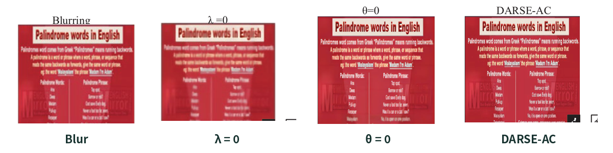

# DARSE-AC

**Combining Salient Edges and Average Curvature Regularization for Blind Image Deconvolution**

Tan, S., Dong, L., An, L. (2025). *The Regularization and Deconvolution Algorithm Combining Salient Edges and Average Curvature in High-quality Visual Communication*. Information Technology and Control, 54(1), 234–253. [DOI: 10.5755/j01.itc.54.1.38163](https://doi.org/10.5755/j01.itc.54.1.38163)

---

## Research Problem

Images acquired in degraded conditions — heritage documents, rubbings, text archives, low-light scenes — are often corrupted by motion blur, defocus, and noise. Blind deconvolution seeks to recover a sharp image from a single blurred observation, but the problem is severely ill-posed: both the latent image and an unknown blur kernel must be estimated simultaneously. Generic priors either over-smooth edges or amplify noise, especially where fine strokes and ornamentation carry the information.

## Method

DARSE-AC formulates image deblurring as a joint variational problem with two complementary regularizers:

```text
min_{I,k}  ‖k·I − A‖² + λ‖∇I − ∇z‖² + ξ‖∇I‖₀ + θ·Q(I)
min_k      ‖∇z·k − ∇A‖² + τ‖k‖²
```

- **Salient-edge prior** explicitly selects major structures `z`, preserving lettering and stroke boundaries while suppressing texture that would mislead kernel estimation;
- **Average-curvature (AC) regularization** interprets intensity as a height field and constrains local bending energy in non-edge regions, mitigating staircase artifacts;
- **HQS splitting** introduces auxiliary variables and decomposes the objective into tractable subproblems;
- **FFT-based closed-form updates** solve the image subproblem in the frequency domain;
- The fuzzy kernel is estimated in the gradient domain with ridge regularization, followed by nonnegativity and normalization;
- A **coarse-to-fine pyramid** refines image and kernel across scales.


## Results

The method is evaluated on text images (ICDAR2019), natural scenes (iNaturalist 2021), low-light images (GLADNet), and realistic blur (RESID), covering parameter sensitivity, module ablation, convergence, and cross-dataset generalization.

| Dataset | PSNR | SSIM | ER | Success rate |
|---|--:|--:|--:|--:|
| iNaturalist 2021 | **31.03 dB** | **0.96** | **1.61** | **99.54%** |
| ICDAR2019 | 30.29 dB | 0.96 | — | — |
| GLADNet | 25.16 dB | 0.90 | — | — |
| RESID (total) | 20.56 dB | — | — | — |

**Key findings:**

- Salient-edge selection and AC regularization are complementary; their joint use restores text regions more clearly than either module alone.
- The improved objective curve flattens within roughly ten iterations, while average kernel similarity increases with the number of iterations.
- The method attains the best quantitative performance on iNaturalist 2021 against eight baselines, and generalizes across datasets.
- Strong noise and spatially varying blur remain open challenges.



*Excerpt of Fig. 8 from the published paper (λ=0, θ=0, DARSE-AC). Full settings are described in the paper.*

## Application Context

The work was motivated by restoring blurred, noisy rubbing images of the ancient Zhongshan Kingdom for use in design-material extraction. The paper establishes and validates the algorithm on public datasets; deployment on actual cultural-object imagery requires authorized sources, expert stroke-fidelity assessment, and artifact review.

## Code

The implementation mirrors the paper's pipeline:

```bash
python -m venv .venv
.venv/bin/python -m pip install -r requirements.txt

.venv/bin/python experiment.py demo --output results/demo
.venv/bin/python experiment.py benchmark --output results/benchmark
.venv/bin/python experiment.py ablation --output results/ablation
.venv/bin/python -m pytest -q --junitxml=results/pytest.xml

.venv/bin/python experiment.py deblur input.png \
  --output results/your_image --kernel-size 15 --levels 3 --outer 5
```

| File | Contents |
|---|---|
| `darse_ac.py` | Gradients/adjoints, periodic convolution, AC discretization, L0 thresholding, FFT image update, kernel estimation, pyramid, final restoration |
| `experiment.py` | `demo`, `benchmark`, `ablation`, `deblur` commands |
| `test_darse_ac.py` | Numerical operators, FFT normal equations, kernel normalization, determinism, CLI tests |
| `RECONSTRUCTION.md` | Equation-to-code conventions and discretization choices |
| `assets/` | Pipeline diagrams and attributed paper figures |

Implementation conventions (grayscale `[0,1]`, centered odd kernels, periodic boundaries, HQS schedule, AC discrete surrogate) are documented in `RECONSTRUCTION.md`. Reported figures and metrics are quotes from the publication; paper figures remain with the authors and rights holders per journal terms.

## Citation

```bibtex
@article{tan2025darseac,
  author  = {Tan, Shuo and Dong, Lingye and An, Limei},
  title   = {The Regularization and Deconvolution Algorithm Combining Salient Edges and Average Curvature in High-quality Visual Communication},
  journal = {Information Technology and Control},
  volume  = {54},
  number  = {1},
  pages   = {234--253},
  year    = {2025},
  doi     = {10.5755/j01.itc.54.1.38163}
}
```
